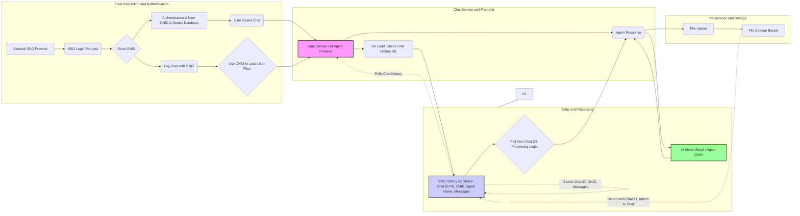

```mermaid
graph LR
    subgraph User Interaction and Authentication
        A[External SSO Provider] --> B(SSO Login Request);
        B --> C{Store ONID};
        C --> D(Log User with ONID);
        D --> E{Use ONID to Load User Filter};
        C --> F[Authentication & User ONID & Details Database];
        F --> G(User Opens Chat);
    end

    subgraph Chat Service and Frontend
        G --> H[Chat Service / AI Agent Frontend];
        E --> H;
        H --> I(On Load: Check Chat History DB);
        H --> J(Agent Response);
    end

    subgraph Data and Processing
        I --> K[Chat History Database];
        K -.-> |Pulls Chat History| H;
        K[Chat History Database] --> L{Pull from Chat DB Processing Logic};
        L --> J;
        J --> M[AI Model Script / Agent ONID];
        M --> J;
    end
    
    subgraph Persistence and Storage
        K -.-> |Stores Chat ID, ONID, Messages| K[Chat History Database: Chat ID PK, ONID, Agent Name, Messages];
        J --> N[File Upload];
        N --> O[File Storage Bucket];
        O -.-> |Stored with Chat ID, Attach to Chat| K;
    end
    
    style H fill:#f9f,stroke:#333,stroke-width:2px
    style M fill:#9f9,stroke:#333,stroke-width:2px
    style K fill:#ccf,stroke:#333,stroke-width:2px
	subGraph2 --- n1
```
