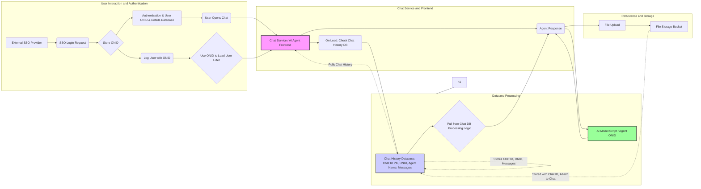

# General Architecture

> **Note:** This diagram was created during the initial design phase. It captures the intended data flow for authentication, chat, agent routing, and persistence. The actual implementation uses **SvelteKit** (not a generic "chat UI") and **FastAPI + Peewee/SQLite** (not generic "Node.js or Python"), but the data-flow relationships shown here are accurate. For the authoritative component breakdown, see [CLAUDE.md](../CLAUDE.md).

## Data Flow

The diagram below shows how a user request travels through the system:

1. The user authenticates via Microsoft SSO (MSAL/ONID).
2. The chat UI sends the query to the Open WebUI backend.
3. The backend looks up the target agent's endpoint from the agent registry.
4. The backend forwards the message to the agent via A2A (JSON-RPC 2.0).
5. The agent response is streamed back to the browser.
6. Chat history is persisted to the database.

