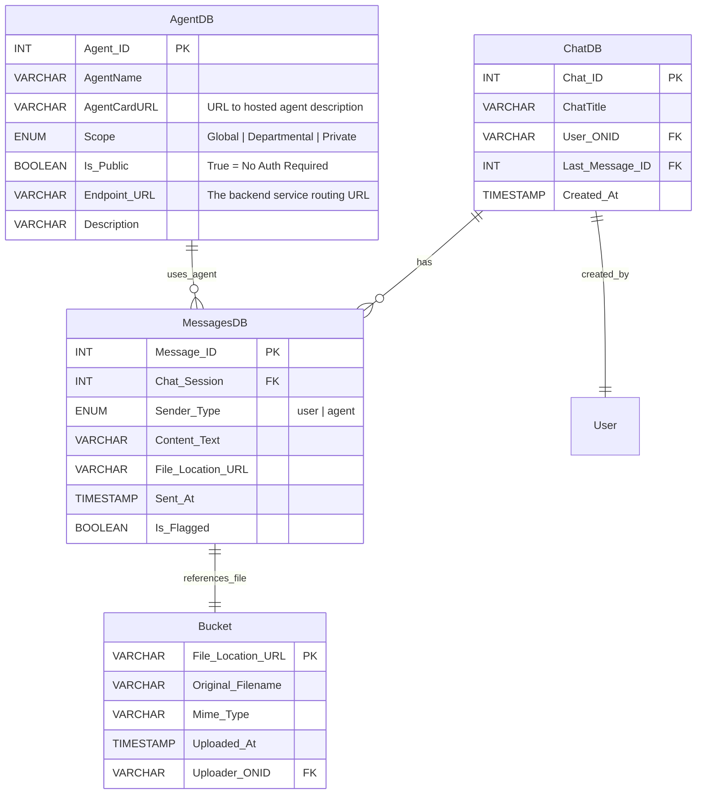

# Database Schemas

> **Note:** This ER diagram reflects the initial target schema. The production implementation builds on top of the existing Open WebUI schema (Peewee/SQLite in `front/backend/open_webui/models/`). Custom tables added by this project are in `agents.py`, `registry.py`, and `tickets.py` within that directory. The entities below map to those tables conceptually, though column names and relationships may differ in the actual Peewee models.

## Entity Relationships

- **ChatDB** — one chat session per user, linked to a sequence of messages
- **MessagesDB** — individual messages within a chat, attributed to a user or agent
- **AgentDB** — registered agents (mirrors `AgentModel` in `models/agents.py`)
- **Bucket** — file uploads attached to chat sessions (GCS-backed in production)

