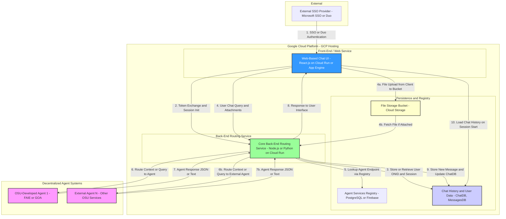

# Server Architecture

> **Note:** This diagram was created during the initial design phase. Some technology labels (e.g. "React.js", "Node.js", "PostgreSQL or Firebase") reflect early candidates that were later replaced. The actual implementation uses **SvelteKit** for the frontend, **FastAPI + Peewee/SQLite** for the backend, and **GCP Cloud Run** for compute. The structural relationships and data-flow numbered steps are accurate. See [CLAUDE.md](../CLAUDE.md) for the definitive tech stack.

## System Topology

The diagram below shows how the major system components interact at the infrastructure level:

- Authentication is handled by the external Microsoft SSO provider (Azure MSAL / ONID).
- All compute runs on **Google Cloud Run** in the `osu-genesis-hub` GCP project.
- The frontend and backend are packaged in a single Docker image (see `Dockerfile` and `cloudbuild.yaml`).
- Agents are independently deployed Cloud Run services, registered with the hub via `/.well-known/agent.json`.
- Chat history and user data persist in SQLite (dev) or can be migrated to PostgreSQL (production).
- File uploads use **Google Cloud Storage**.

